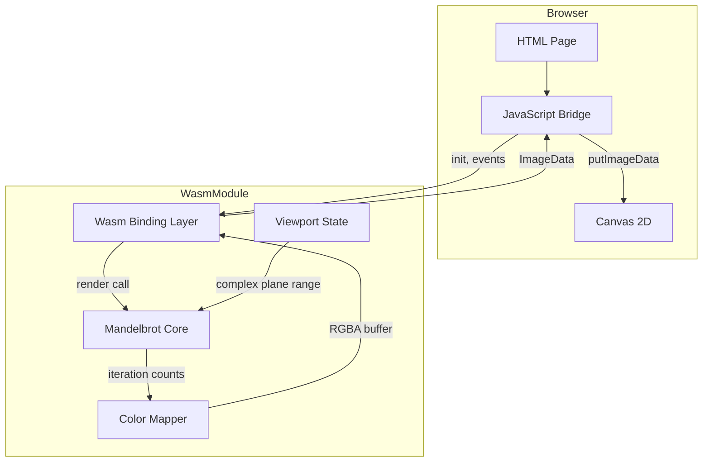
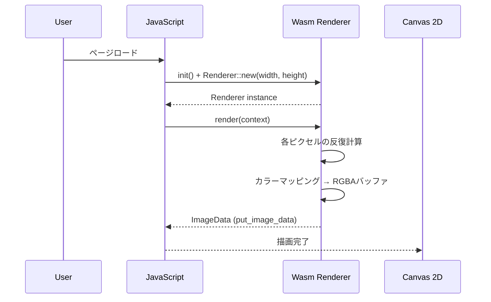
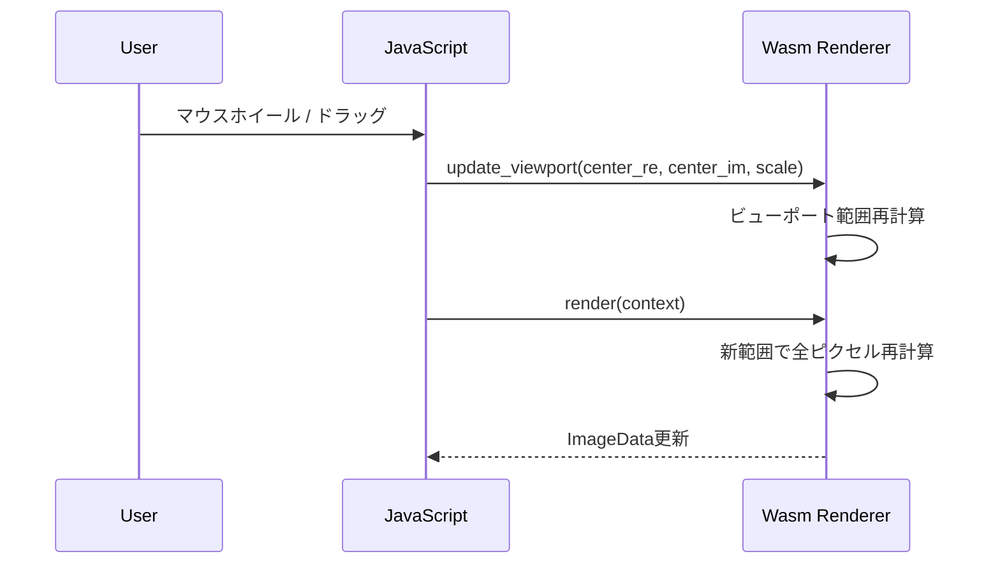
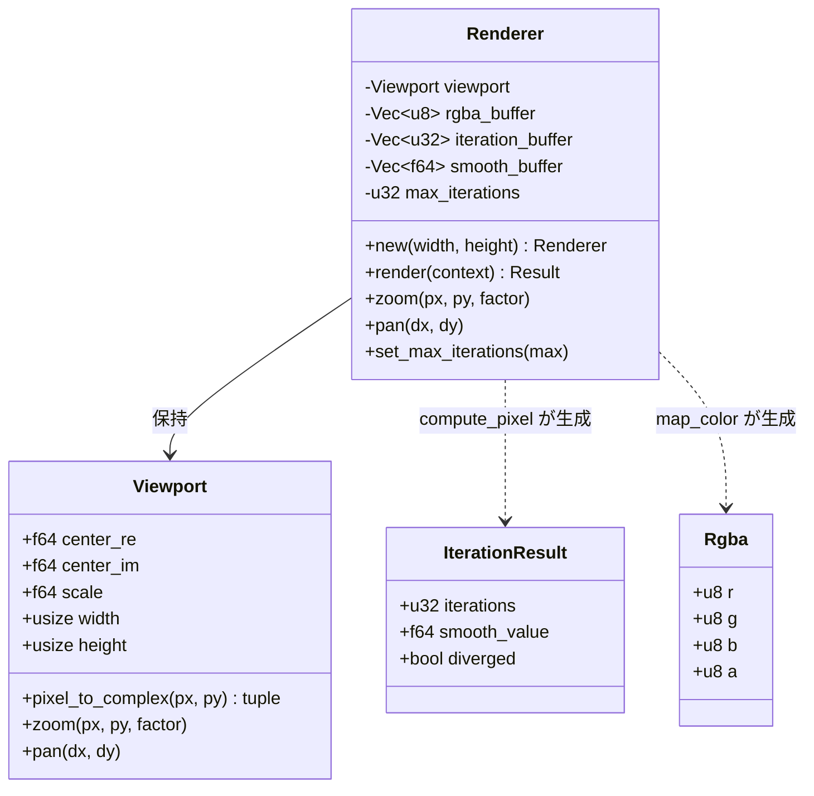

# Design Document: mandelbrot-wasm-renderer

## Overview

**Purpose**: マンデルブロ集合をRustで高速に計算し、WebAssemblyを通じてブラウザ上のHTML Canvasにインタラクティブに描画するWebアプリケーションを提供する。

**Users**: フラクタル幾何学に関心のあるユーザーが、ブラウザ上でズーム・パン操作によりマンデルブロ集合の詳細構造を探索する。

**Impact**: グリーンフィールドプロジェクト。Rustの計算性能をWasm経由でブラウザに持ち込み、インストール不要で高速なフラクタル描画体験を実現する。

### Goals
- マンデルブロ集合の正確な反復計算と発散判定
- Wasm経由でのCanvas 2Dリアルタイム描画
- ズーム・パンによるインタラクティブな探索
- スムーズカラーリングによる視覚的に美しい表現

### Non-Goals
- WebGL / GPU計算による高速化（Canvas 2D APIのみ使用）
- Web Workerによるオフスレッド計算（初期スコープ外）
- 任意精度演算によるf64限界を超えた深いズーム
- 画像エクスポート機能
- モバイルタッチ操作対応

## Architecture

### Architecture Pattern & Boundary Map



**Architecture Integration**:
- **Selected pattern**: レイヤード（計算コア → Wasmバインディング → JS描画ブリッジ）。計算ロジックをWasm依存から分離し、純粋Rustとしてテスト可能にする
- **Domain boundaries**: Rust側は計算とバッファ管理に責任を持ち、JS側はDOM操作とイベントハンドリングのみを担当
- **Existing patterns preserved**: steering structure.mdのレイヤー分離原則に準拠
- **New components rationale**: 各コンポーネントは単一責務（計算・色変換・ビューポート管理・バインディング）
- **Steering compliance**: `#[wasm_bindgen]` はエクスポート境界のみ、フレームワーク不使用、vanilla JS

### Technology Stack

| Layer | Choice / Version | Role in Feature | Notes |
|-------|------------------|-----------------|-------|
| 計算コア | Rust Edition 2024 | マンデルブロ集合の反復計算 | f64精度 |
| Wasmバインディング | wasm-bindgen 0.2.x | Rust ↔ JS型変換、関数エクスポート | `Clamped` でピクセルデータ受け渡し |
| Web API | web-sys 0.3.x | Canvas, Document, Window アクセス | feature flags で必要なAPIのみ有効化 |
| ビルド | wasm-pack 0.14.x | Wasmバイナリ + JSグルーコード生成 | `--target web` |
| フロントエンド | HTML + vanilla JS (ES modules) | DOM操作、イベント処理、Wasmロード | フレームワーク不使用 |

## System Flows

### 描画フロー



### ズーム・パンフロー



## Requirements Traceability

| Requirement | Summary | Components | Interfaces | Flows |
|-------------|---------|------------|------------|-------|
| 1.1 | 反復計算 z = z² + c | MandelbrotCore | `compute_pixel()` | 描画フロー |
| 1.2 | 最大反復回数による発散判定 | MandelbrotCore | `compute_pixel()` max_iterations引数 | 描画フロー |
| 1.3 | 反復回数に基づく色決定 | ColorMapper | `map_color()` | 描画フロー |
| 1.4 | 集合内ピクセルの黒色処理 | ColorMapper | `map_color()` の分岐 | 描画フロー |
| 2.1 | wasm32-unknown-unknown コンパイル | ビルド設定 | Cargo.toml | — |
| 2.2 | wasm-bindgen バインディング | WasmBinding | `#[wasm_bindgen]` exports | — |
| 2.3 | HTMLからWasmロード・描画 | JSBridge | `init()`, ES module import | 描画フロー |
| 2.4 | wasm-pack ビルド | ビルド設定 | `wasm-pack build --target web` | — |
| 3.1 | RGBA ImageData描画 | WasmBinding | `render()` → `put_image_data` | 描画フロー |
| 3.2 | Canvas全体一括描画 | WasmBinding | `render()` 1回のput_image_data | 描画フロー |
| 3.3 | Canvasサイズ連動解像度 | WasmBinding | `Renderer::new(width, height)` | 描画フロー |
| 4.1 | マウスホイールズーム | JSBridge | `wheel` イベント → `update_viewport()` | ズーム・パンフロー |
| 4.2 | ドラッグパン | JSBridge | `mousedown/move/up` → `update_viewport()` | ズーム・パンフロー |
| 4.3 | ズームレベル連動範囲再計算 | Viewport | `update_viewport()` 内部計算 | ズーム・パンフロー |
| 4.4 | 初期表示領域 | Viewport | デフォルト値: re [-2.0, 1.0], im [-1.5, 1.5] | 描画フロー |
| 5.1 | グラデーションカラーマッピング | ColorMapper | `map_color()` HSL変換 | 描画フロー |
| 5.2 | 集合内部の黒色描画 | ColorMapper | `map_color()` 分岐 | 描画フロー |
| 5.3 | スムーズカラーリング | MandelbrotCore + ColorMapper | 連続値反復回数計算 | 描画フロー |
| 6.1 | Wasm内高速計算 | MandelbrotCore | Rust実装 → Wasmコンパイル | 描画フロー |
| 6.2 | 効率的メモリ割り当て | WasmBinding | `Vec<u8>` バッファ再利用 | 描画フロー |
| 6.3 | UIスレッド非ブロッキング | JSBridge | `requestAnimationFrame` | 描画フロー |

## Components and Interfaces

| Component | Domain/Layer | Intent | Req Coverage | Key Dependencies | Contracts |
|-----------|-------------|--------|--------------|-----------------|-----------|
| MandelbrotCore | 計算コア | ピクセル単位の反復計算と発散判定 | 1.1, 1.2, 5.3, 6.1 | なし | Service |
| ColorMapper | 計算コア | 反復回数からRGBA色への変換 | 1.3, 1.4, 5.1, 5.2, 5.3 | MandelbrotCore (P1) | Service |
| Viewport | 計算コア | 複素平面のビューポート状態管理 | 4.3, 4.4 | なし | State |
| WasmBinding (Renderer) | バインディング | Wasm↔JS境界、バッファ管理、描画実行 | 2.1, 2.2, 3.1, 3.2, 3.3, 6.2 | MandelbrotCore (P0), ColorMapper (P0), Viewport (P0), web-sys (P0) | Service, State |
| JSBridge | フロントエンド | Wasmロード、イベント処理、DOM操作 | 2.3, 4.1, 4.2, 6.3 | WasmBinding (P0) | — |

### 計算コア

#### MandelbrotCore

| Field | Detail |
|-------|--------|
| Intent | 複素平面上の座標に対するマンデルブロ集合の反復計算と発散判定 |
| Requirements | 1.1, 1.2, 5.3, 6.1 |

**Responsibilities & Constraints**
- z = z² + c の反復計算を実行し、発散判定（|z| > 2.0）を行う
- Wasm/web-sys に依存しない純粋なRustモジュール
- f64精度で計算（約1e-15の精度限界）

**Dependencies**
- External: なし（標準ライブラリのみ）

**Contracts**: Service [x]

##### Service Interface
```rust
/// 単一ピクセルの反復計算結果
struct IterationResult {
    iterations: u32,
    /// スムーズカラーリング用の連続値（発散時のみ有効）
    smooth_value: f64,
    diverged: bool,
}

/// ピクセル座標に対応する複素数の反復計算を実行する
fn compute_pixel(cr: f64, ci: f64, max_iterations: u32) -> IterationResult;

/// バッファ全体の一括計算（ビューポート情報を使用）
fn compute_region(
    buffer: &mut [u32],  // iteration results
    width: usize,
    height: usize,
    viewport: &Viewport,
    max_iterations: u32,
);
```
- Preconditions: `max_iterations > 0`, `width * height == buffer.len()`
- Postconditions: 各バッファ要素に反復回数が格納される
- Invariants: 計算結果は同一入力に対して決定的

#### ColorMapper

| Field | Detail |
|-------|--------|
| Intent | 反復回数からRGBAピクセル値への変換 |
| Requirements | 1.3, 1.4, 5.1, 5.2, 5.3 |

**Responsibilities & Constraints**
- 反復回数をHSLベースのグラデーションに変換
- 集合内ピクセル（未発散）は黒色 (0, 0, 0, 255) を返す
- スムーズカラーリングで連続的な色遷移を実現
- Wasm/web-sys に依存しない純粋なRustモジュール

**Dependencies**
- Inbound: MandelbrotCore — IterationResult を受け取る (P1)

**Contracts**: Service [x]

##### Service Interface
```rust
/// RGBA色値
struct Rgba {
    r: u8,
    g: u8,
    b: u8,
    a: u8,
}

/// 反復結果をRGBA色に変換する
fn map_color(result: &IterationResult, max_iterations: u32) -> Rgba;

/// バッファ全体の一括カラーマッピング
fn apply_colormap(
    iteration_buffer: &[u32],
    smooth_buffer: &[f64],
    rgba_buffer: &mut [u8],
    max_iterations: u32,
);
```
- Preconditions: `rgba_buffer.len() == iteration_buffer.len() * 4`
- Postconditions: rgba_bufferの各4バイトに有効なRGBA値が格納される

#### Viewport

| Field | Detail |
|-------|--------|
| Intent | 複素平面上の表示領域の状態管理と座標変換 |
| Requirements | 4.3, 4.4 |

**Responsibilities & Constraints**
- 中心座標（複素数）とスケールでビューポートを管理
- ピクセル座標 ↔ 複素平面座標の変換
- アスペクト比を考慮した表示範囲計算

**Dependencies**
- External: なし

**Contracts**: State [x]

##### State Management
```rust
struct Viewport {
    center_re: f64,    // 表示中心の実部
    center_im: f64,    // 表示中心の虚部
    scale: f64,        // 1ピクセルあたりの複素平面上の幅
    width: usize,      // Canvas幅（ピクセル）
    height: usize,     // Canvas高さ（ピクセル）
}

impl Viewport {
    /// 初期ビューポート（実部 -2.0〜1.0、虚部 -1.5〜1.5）
    fn new(width: usize, height: usize) -> Self;

    /// ピクセル座標から複素平面座標への変換
    fn pixel_to_complex(&self, px: usize, py: usize) -> (f64, f64);

    /// 指定ピクセル位置を中心にズーム
    fn zoom(&mut self, px: f64, py: f64, factor: f64);

    /// 表示領域をピクセル差分だけパン
    fn pan(&mut self, dx: f64, dy: f64);
}
```
- Persistence: Wasm構造体のフィールドとしてメモリ内に保持
- Concurrency: シングルスレッド（ブラウザメインスレッド）

### バインディング層

#### WasmBinding (Renderer)

| Field | Detail |
|-------|--------|
| Intent | Wasm↔JS境界の管理、RGBAバッファ保持、Canvas描画実行 |
| Requirements | 2.1, 2.2, 3.1, 3.2, 3.3, 6.2 |

**Responsibilities & Constraints**
- `#[wasm_bindgen]` でJSにエクスポートされる唯一のコンポーネント
- `Vec<u8>` RGBAバッファを構造体フィールドとして保持・再利用（research.md: static mut回避）
- `ImageData::new_with_u8_clamped_array_and_sh` + `put_image_data` で一括描画
- 反復回数中間バッファも構造体で管理

**Dependencies**
- Inbound: JSBridge — JS側からのrender/update呼び出し (P0)
- Outbound: MandelbrotCore — 計算実行 (P0)
- Outbound: ColorMapper — 色変換 (P0)
- Outbound: Viewport — ビューポート状態 (P0)
- External: wasm-bindgen 0.2.x — JS相互運用 (P0)
- External: web-sys 0.3.x — Canvas API (P0)

**Contracts**: Service [x] / State [x]

##### Service Interface
```rust
#[wasm_bindgen]
pub struct Renderer {
    // 内部フィールド（JSには非公開）
    // viewport: Viewport,
    // rgba_buffer: Vec<u8>,
    // iteration_buffer: Vec<u32>,
    // smooth_buffer: Vec<f64>,
    // max_iterations: u32,
}

#[wasm_bindgen]
impl Renderer {
    #[wasm_bindgen(constructor)]
    pub fn new(width: usize, height: usize) -> Self;

    /// 現在のビューポートでフル描画
    pub fn render(&mut self, context: &CanvasRenderingContext2d) -> Result<(), JsValue>;

    /// ビューポートのズーム操作
    pub fn zoom(&mut self, px: f64, py: f64, factor: f64);

    /// ビューポートのパン操作
    pub fn pan(&mut self, dx: f64, dy: f64);

    /// 最大反復回数の設定
    pub fn set_max_iterations(&mut self, max: u32);
}
```
- Preconditions: `context` は有効な `CanvasRenderingContext2d` 参照
- Postconditions: `render()` 完了後、Canvasに最新のフラクタル画像が描画される
- Invariants: `rgba_buffer` のサイズは常に `width * height * 4`

##### State Management
- `Vec<u8>` RGBAバッファ: フレーム間で再利用、`new()` 時に1回だけ確保
- `Vec<u32>` 反復回数バッファ: compute_region の出力先として再利用
- `Vec<f64>` スムーズ値バッファ: スムーズカラーリング用

**Implementation Notes**
- Integration: `Clamped(&self.rgba_buffer)` で `ImageData` 生成。バッファ自体はコピーされず参照のみ
- Validation: `width`, `height` は0より大きいことをコンストラクタで検証
- Risks: 大きなキャンバスサイズでのメモリ使用量（4K: 3840x2160 = 約33MB）

### フロントエンド層

#### JSBridge

| Field | Detail |
|-------|--------|
| Intent | Wasmモジュールのロード、DOMイベント処理、Canvas管理 |
| Requirements | 2.3, 4.1, 4.2, 6.3 |

**Responsibilities & Constraints**
- ES module として `init()` + `Renderer` をインポート
- `wheel` イベントでズーム、`mousedown/mousemove/mouseup` でパン
- `requestAnimationFrame` で再描画をスケジュール
- HTML/CSS でCanvasレイアウト管理

**Dependencies**
- Outbound: WasmBinding — Renderer API呼び出し (P0)
- External: ブラウザ DOM API (P0)

**Implementation Notes**
- Integration: `<script type="module">` で `./pkg/mandelbrot.js` をインポート
- Validation: Canvasサイズを `window.innerWidth/Height` または固定値で設定
- Risks: イベントハンドラの高頻度呼び出し。`wheel` にはデバウンスまたはthrottle不要（rAFが自然にスロットルする）

## Data Models

### Domain Model



**ビジネスルール & 不変条件**:
- `scale > 0` — ゼロスケールは不正
- `max_iterations > 0` — 最低1回の反復が必要
- `|z| > 2.0` で発散と判定（数学的に証明された閾値）
- RGBAバッファサイズ = `width * height * 4` が常に成立

## Error Handling

### Error Strategy
Wasm境界のエラーは `Result<(), JsValue>` で伝搬し、JS側で処理する。計算コア内部ではパニックを避け、型安全な設計でエラーの発生自体を防止する。

### Error Categories and Responses
- **User Errors**: 存在しないCanvas ID → `JsValue` エラーでJS側にログ出力
- **System Errors**: Wasmメモリ不足 → バッファ確保失敗時に `JsValue` エラーを返却
- **Business Logic Errors**: なし（数学的計算のため入力バリデーション不要）

### Monitoring
- `web_sys::console::log_1` によるデバッグログ出力（開発時のみ）
- パフォーマンス計測: `web_sys::Performance::now()` でフレーム時間を測定可能

## Testing Strategy

### Unit Tests (cargo test)
- `compute_pixel`: 既知の集合内座標 (0, 0) → 未発散確認
- `compute_pixel`: 既知の集合外座標 (2, 2) → 即座に発散確認
- `compute_pixel`: 境界付近の座標 → 期待反復回数の検証
- `map_color`: 未発散（集合内）→ 黒色 (0, 0, 0, 255) 確認
- `map_color`: 発散ケース → 非黒色のRGBA値確認
- `Viewport::pixel_to_complex`: ピクセル中心 → ビューポート中心座標一致確認
- `Viewport::zoom`: ズーム後のscale変化確認
- `Viewport::pan`: パン後のcenter移動確認

### Integration Tests (wasm-pack test)
- `Renderer::new` → `render` → ImageData生成成功の確認
- ズーム後の `render` → 画像データ変化の確認
- パン後の `render` → 画像データ変化の確認

## Performance & Scalability

**ターゲット指標**:
- 800x600 Canvas: 1フレーム描画 < 16ms（60fps相当）
- 1920x1080 Canvas: 1フレーム描画 < 50ms（許容範囲）

**最適化手法**:
- RGBAバッファの再利用（フレーム毎の再確保回避）
- ループ内の分岐最小化（compute_pixel のホットパス最適化）
- `--release` ビルドによるWasm最適化（wasm-opt自動適用）

**将来の最適化候補**（現スコープ外）:
- Web Worker + OffscreenCanvas によるオフスレッド計算
- SIMD命令の活用
- タイルベースの差分更新
