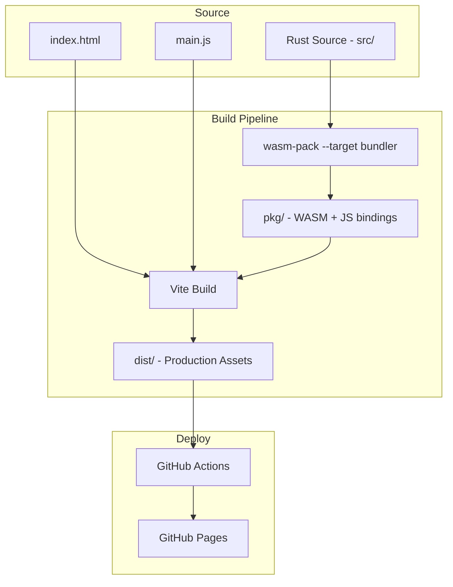
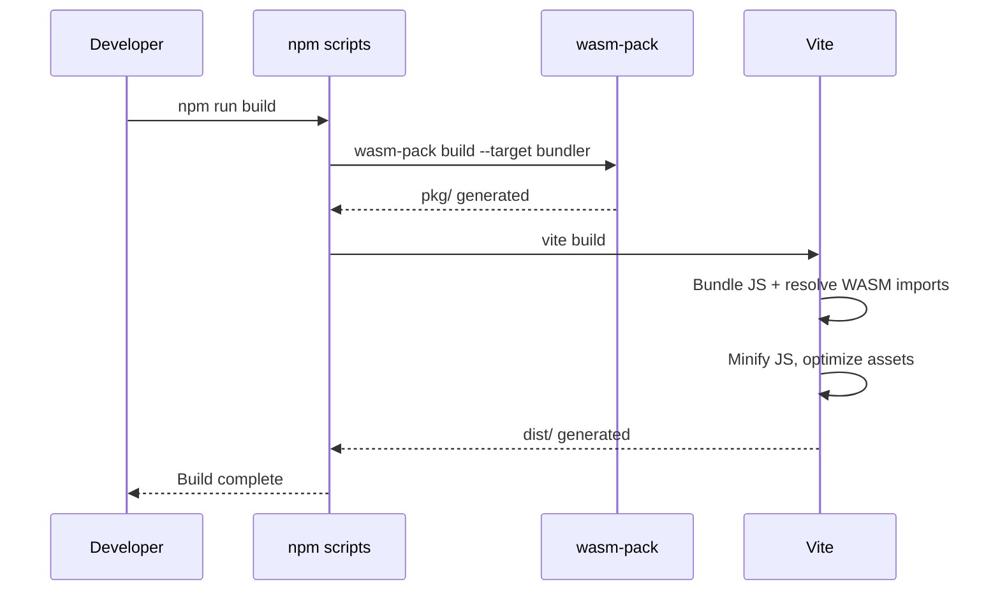
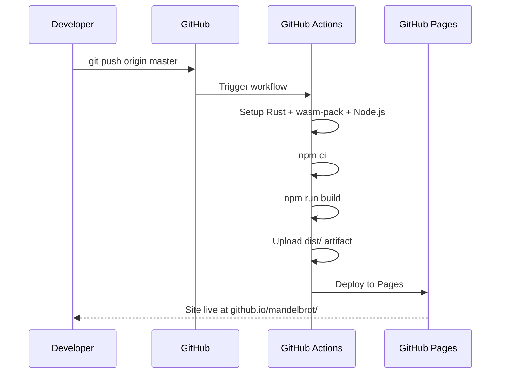

# Design Document: spa-github-pages-deployment

## Overview

**Purpose**: 既存のマンデルブロ集合WASMレンダラーに、Viteベースのビルドパイプラインを導入し、GitHub Pages上でSPAとして公開可能にする。

**Users**: 開発者（ビルド・デプロイの自動化）およびエンドユーザー（ブラウザでのフラクタル描画体験）が対象。

**Impact**: 現在のバンドラーなし構成（手動HTTPサーバー配信）を、Vite + GitHub Actions CI/CDによる自動ビルド・デプロイ構成に置き換える。Rust/WASMの計算コア（`src/`）には変更を加えない。

### Goals
- wasm-packとViteを統合した単一コマンドのビルドパイプライン確立
- GitHub Actionsによるmasterブランチプッシュ時の自動デプロイ
- ホットリロード対応の開発サーバー提供
- GitHub Pagesサブディレクトリパスでの正常動作

### Non-Goals
- フロントエンドフレームワーク（React, Vue等）の導入
- Rust/WASMの計算コアの機能変更
- カスタムドメインの設定
- Rustビルドキャッシュの最適化（将来の改善ポイント）

## Architecture

### Existing Architecture Analysis

現在の構成:
- `src/` — Rustソース → `wasm-pack build --target web` → `pkg/`（ES Modules形式の.js + .wasm）
- `index.html` + `main.js` — プロジェクトルートに配置、`./pkg/mandelbrot.js` を直接インポート
- 開発サーバー: 任意のHTTPサーバー（`python3 -m http.server`等）

維持するパターン:
- `src/` のモジュール構成（core, color, viewport, renderer）
- `#[wasm_bindgen]` によるエクスポート境界
- Canvas 2D APIによる描画アプローチ
- vanilla JS（フレームワーク不使用）

### Architecture Pattern & Boundary Map



**Architecture Integration**:
- **Selected pattern**: 2段階ビルドパイプライン（wasm-pack → Vite）。wasm-packがRust→WASMコンパイルを担当し、ViteがフロントエンドバンドリングとWASMアセット管理を担当
- **Domain/Feature boundaries**: Rust計算コア（`src/`）はビルドパイプライン変更の影響を受けない。変更はフロントエンドビルド設定とCI/CD設定に限定
- **Existing patterns preserved**: Rustモジュール構成、Canvas描画、vanilla JS
- **New components rationale**: Vite設定（ビルドパイプライン）、GitHub Actionsワークフロー（自動デプロイ）、package.json（依存管理）
- **Steering compliance**: 「フレームワーク不使用」を維持。Viteはビルドツールであり、ランタイムフレームワークではない

### Technology Stack

| Layer | Choice / Version | Role in Feature | Notes |
|-------|------------------|-----------------|-------|
| Build Tool | Vite 6.x | フロントエンドバンドル、dev server、本番ビルド | ESMネイティブ、高速HMR |
| WASM Plugin | vite-plugin-wasm (latest) | WASM ESMインテグレーション | wasm-pack生成モジュール対応 |
| Async Plugin | vite-plugin-top-level-await (latest) | トップレベルawaitサポート | vite-plugin-wasmの必須併用プラグイン |
| WASM Build | wasm-pack (`--target bundler`) | Rust→WASMコンパイル + JSバインディング生成 | `--target web`から変更 |
| Rust Watch | cargo-watch | Rustソースの変更検知・自動wasm-packリビルド（dev時） | `cargo install cargo-watch` が必要 |
| Process Runner | concurrently (latest) | 開発時のcargo-watchとVite dev serverの並列実行 | devDependencies |
| CI/CD | GitHub Actions | 自動ビルド・デプロイ | `actions/deploy-pages` 使用 |
| Hosting | GitHub Pages | 静的サイトホスティング | `https://<user>.github.io/mandelbrot/` |

> wasm-pack targetを `--target web` から `--target bundler` に変更する理由の詳細は `research.md` を参照。

## System Flows

### ビルドフロー



### CI/CDデプロイフロー



## Requirements Traceability

| Requirement | Summary | Components | Interfaces | Flows |
|-------------|---------|------------|------------|-------|
| 1.1 | 単一コマンドビルド | BuildScripts | npm scripts | ビルドフロー |
| 1.2 | dist/出力 | ViteConfig | vite.config.js | ビルドフロー |
| 1.3 | WASMバンドル | ViteConfig, WasmPlugin | vite-plugin-wasm | ビルドフロー |
| 1.4 | 開発モード自動リビルド | BuildScripts, ViteConfig | npm run dev | — |
| 1.5 | 本番最小化・最適化 | ViteConfig | vite build | ビルドフロー |
| 2.1 | ローカルHTTPサーバー | ViteConfig | vite dev server | — |
| 2.2 | WASM MIMEタイプ | ViteConfig | Vite dev server | — |
| 2.3 | 自動リビルド | BuildScripts | npm run dev | — |
| 3.1 | masterプッシュ時ビルド | CIPipeline | deploy.yml | CI/CDフロー |
| 3.2 | 自動デプロイ | CIPipeline | deploy-pages action | CI/CDフロー |
| 3.3 | GitHub Actions構成 | CIPipeline | deploy.yml | CI/CDフロー |
| 3.4 | 環境セットアップ自動化 | CIPipeline | deploy.yml | CI/CDフロー |
| 3.5 | ビルド失敗時デプロイ中止 | CIPipeline | deploy.yml | CI/CDフロー |
| 4.1 | 単一HTMLエントリー | SPAEntry | index.html | — |
| 4.2 | サブディレクトリパス対応 | ViteConfig | base設定 | — |
| 4.3, 4.5 | ローディング表示 | SPAEntry | index.html CSS/JS | — |
| 4.4 | 既存機能維持 | AppModule | main.js | — |
| 5.1 | gitignore更新 | RepoConfig | .gitignore | — |
| 5.2 | package.json管理 | RepoConfig | package.json | — |
| 5.3 | ドキュメント | RepoConfig | README.md | — |

## Components and Interfaces

| Component | Domain/Layer | Intent | Req Coverage | Key Dependencies | Contracts |
|-----------|--------------|--------|--------------|------------------|-----------|
| ViteConfig | Build | Viteビルド設定とプラグイン構成 | 1.1-1.5, 2.1-2.3, 4.2 | vite-plugin-wasm (P0), vite-plugin-top-level-await (P0) | State |
| BuildScripts | Build | npm scriptsによるビルドオーケストレーション | 1.1, 1.4, 2.3 | wasm-pack (P0), Vite (P0) | Service |
| CIPipeline | Deploy | GitHub Actionsワークフロー定義 | 3.1-3.5 | actions/deploy-pages (P0), Rust toolchain (P0) | Service |
| SPAEntry | Frontend | HTMLエントリーポイントとローディングUI | 4.1, 4.3, 4.5 | — | State |
| AppModule | Frontend | メインアプリケーションロジック（main.js更新） | 4.4 | pkg/mandelbrot.js (P0) | Service |
| RepoConfig | Repository | .gitignore、package.json、ドキュメント | 5.1-5.3 | — | — |

### Build Layer

#### ViteConfig

| Field | Detail |
|-------|--------|
| Intent | Viteビルド設定。WASMプラグイン統合、ベースパス設定、本番最適化を定義 |
| Requirements | 1.1, 1.2, 1.3, 1.5, 2.1, 2.2, 4.2 |

**Responsibilities & Constraints**
- vite-plugin-wasmとvite-plugin-top-level-awaitを統合し、WASMモジュールのESMインポートを有効化
- `base: '/mandelbrot/'` を設定し、GitHub Pagesサブディレクトリパスでの動作を保証
- 本番ビルド時のJS最小化はViteのデフォルト動作（Rollup）に委ねる

**Dependencies**
- External: vite — ビルドツール本体 (P0)
- External: vite-plugin-wasm — WASM ESMインテグレーション (P0)
- External: vite-plugin-top-level-await — 非同期初期化サポート (P0)

**Contracts**: State [x]

##### State Management

```javascript
// vite.config.js
import { defineConfig } from 'vite';
import wasm from 'vite-plugin-wasm';
import topLevelAwait from 'vite-plugin-top-level-await';

defineConfig({
  base: '/mandelbrot/',
  plugins: [wasm(), topLevelAwait()],
  build: {
    target: 'esnext',
    outDir: 'dist',
  },
});
```

- State model: 静的設定ファイル。ランタイム状態なし
- `base` はリポジトリ名に合わせて設定（環境変数での動的設定は行わない）

**Implementation Notes**
- `build.target: 'esnext'` はWASM ESMインポートのブラウザサポートを前提。主要ブラウザの最新版で対応済み
- Viteのdev serverはWASMファイルに正しいMIMEタイプ（`application/wasm`）を自動付与

#### BuildScripts

| Field | Detail |
|-------|--------|
| Intent | wasm-packとViteを統合するnpm scriptsの定義 |
| Requirements | 1.1, 1.4, 2.3 |

**Responsibilities & Constraints**
- `build` スクリプト: wasm-pack → vite build の2段階を順次実行
- `dev` スクリプト: wasm-packの初回ビルド後、Rustソース監視（cargo-watch）とVite dev serverを並列起動
- wasm-packは `--target bundler` を使用
- 開発モードでは `cargo-watch` がRustソースの変更を検知し、wasm-packを自動再実行する

**Dependencies**
- External: wasm-pack — Rust→WASMコンパイル (P0)
- External: cargo-watch — Rustソースのファイル監視 (P0, 開発時のみ)
- Outbound: ViteConfig — ビルド設定参照 (P0)

**Contracts**: Service [x]

##### Service Interface

```json
{
  "scripts": {
    "build:wasm": "wasm-pack build --target bundler",
    "build:web": "vite build",
    "build": "npm run build:wasm && npm run build:web",
    "dev:wasm-watch": "cargo watch -w src -s \"wasm-pack build --target bundler\"",
    "dev": "npm run build:wasm && concurrently \"npm:dev:wasm-watch\" \"vite\"",
    "preview": "vite preview"
  }
}
```

- Preconditions: Rustツールチェーン、wasm-pack、cargo-watch、Node.jsがインストール済み
- Postconditions: `build` 実行後、`dist/` に全アセットが出力される
- Invariants: wasm-pack buildはvite buildの前に完了する必要がある
- Dev mode: `cargo-watch` がRustソース変更を検知 → wasm-pack再ビルド → Viteが `pkg/` の変更を検知 → ブラウザ自動リロード

### Deploy Layer

#### CIPipeline

| Field | Detail |
|-------|--------|
| Intent | GitHub Actionsワークフローによるmasterブランチ自動デプロイ |
| Requirements | 3.1, 3.2, 3.3, 3.4, 3.5 |

**Responsibilities & Constraints**
- masterブランチへのpush時にのみトリガー
- Rustツールチェーン + wasm-pack + Node.js環境を自動セットアップ
- ビルド失敗時はデプロイを実行しない（GitHub Actionsのジョブ依存で制御）

**Dependencies**
- External: actions/checkout — リポジトリチェックアウト (P0)
- External: dtolnay/rust-toolchain — Rustセットアップ (P0)
- External: actions/setup-node — Node.jsセットアップ (P0)
- External: actions/upload-pages-artifact — ビルド成果物アップロード (P0)
- External: actions/deploy-pages — GitHub Pagesデプロイ (P0)

**Contracts**: Service [x]

##### Service Interface

```yaml
# .github/workflows/deploy.yml
name: Deploy to GitHub Pages
on:
  push:
    branches: [master]
permissions:
  contents: read
  pages: write
  id-token: write
concurrency:
  group: pages
  cancel-in-progress: false
jobs:
  build:
    runs-on: ubuntu-latest
    steps:
      - uses: actions/checkout@v4
      - uses: dtolnay/rust-toolchain@stable
      - name: Install wasm-pack
        run: curl https://rustwasm.github.io/wasm-pack/installer/init.sh -sSf | sh
      - uses: actions/setup-node@v4
        with:
          node-version: 20
          cache: npm
      - run: npm ci
      - run: npm run build
      - uses: actions/upload-pages-artifact@v3
        with:
          path: dist
  deploy:
    needs: build
    runs-on: ubuntu-latest
    environment:
      name: github-pages
      url: ${{ steps.deployment.outputs.page_url }}
    steps:
      - id: deployment
        uses: actions/deploy-pages@v4
```

- Preconditions: GitHub Pagesがリポジトリ設定で有効化されている（Source: GitHub Actions）
- Postconditions: `dist/` の内容が `https://<user>.github.io/mandelbrot/` で公開される
- ビルド失敗時: `deploy` ジョブは `needs: build` により自動的にスキップされる

### Frontend Layer

#### SPAEntry

| Field | Detail |
|-------|--------|
| Intent | HTMLエントリーポイントにローディングUIを追加 |
| Requirements | 4.1, 4.3, 4.5 |

**Responsibilities & Constraints**
- WASMモジュールのロード中にローディングインジケーターを表示
- WASMの初期化完了後にローディングインジケーターを非表示にし、Canvasを表示
- CSS-onlyのローディングアニメーション（JS依存なし、WASM未ロード時でも動作保証）

**Dependencies**
- Outbound: AppModule — WASM初期化完了通知 (P0)

**Contracts**: State [x]

##### State Management

```
ローディング状態遷移:
  Initial → Loading (page load) → Ready (WASM init complete)

Loading状態:
  - ローディングインジケーター: 表示
  - Canvas: 非表示 (display: none)

Ready状態:
  - ローディングインジケーター: 非表示 (remove)
  - Canvas: 表示
```

- CSS-onlyスピナーをbody内に配置。main.jsからWASM初期化完了後にDOM操作で除去
- 外部ライブラリは使用しない

#### AppModule

| Field | Detail |
|-------|--------|
| Intent | main.jsのインポートパターンを`--target bundler`出力に適合させる |
| Requirements | 4.4 |

**Responsibilities & Constraints**
- `./pkg/mandelbrot.js` からのインポートを維持
- `init()` 呼び出しパターンを `--target bundler` に合わせて調整
- 既存の描画ロジック（ズーム、パン、requestAnimationFrame）はそのまま維持
- WASM初期化完了後にローディングインジケーターを除去

**Dependencies**
- External: pkg/mandelbrot.js — wasm-pack生成のWASMバインディング (P0)
- Outbound: SPAEntry — ローディング状態の更新 (P1)

**Contracts**: Service [x]

##### Service Interface

```javascript
// main.js の構造（擬似コード）
import init, { Renderer } from './pkg/mandelbrot.js';

async function run() {
    await init();                    // WASM初期化
    removeLoadingIndicator();        // ローディングUI除去
    // ... 既存の描画ロジック（変更なし）
}

run();
```

- Preconditions: vite-plugin-wasmがWASM ESMインポートを解決済み
- Postconditions: Canvasにマンデルブロ集合が描画される
- Invariants: 既存のズーム・パン操作が維持される

### Repository Layer

#### RepoConfig

| Field | Detail |
|-------|--------|
| Intent | リポジトリの整理（gitignore、依存管理、ドキュメント） |
| Requirements | 5.1, 5.2, 5.3 |

**Implementation Notes**
- `.gitignore`: `/dist` を追加（`/target` と `/pkg` は既存）
- `package.json`: vite、vite-plugin-wasm、vite-plugin-top-level-await、concurrentlyをdevDependenciesとして追加
- `node_modules/` を `.gitignore` に追加

## Error Handling

### Error Strategy

| Error Type | Scenario | Response |
|------------|----------|----------|
| Build Error | wasm-pack build失敗 | npmスクリプトが非ゼロ終了。CI/CDではデプロイをスキップ |
| Build Error | Vite build失敗 | npmスクリプトが非ゼロ終了。CI/CDではデプロイをスキップ |
| Runtime Error | WASMロード失敗 | コンソールエラー。ローディングインジケーターが残留（ユーザーにはロード中表示のまま） |
| Deploy Error | GitHub Pages設定未有効化 | `deploy-pages` アクションがエラー。GitHub Actionsログに記録 |

### Monitoring
- GitHub Actionsのビルドステータスバッジ（将来的にREADMEに追加可能）
- ランタイムエラーは `console_error_panic_hook`（既存のRust依存）でコンソールに出力

## Testing Strategy

### Build Tests
- `npm run build` がエラーなく完了し、`dist/` にHTML、JS、WASMファイルが存在することを確認
- `dist/` 内のHTMLがJSとWASMを正しく参照していることを確認

### Integration Tests
- `npm run dev` でdev serverが起動し、ブラウザからCanvasが表示されることを確認
- ズーム・パン操作がdev server環境で正常動作することを確認

### Deployment Tests
- GitHub Pagesの公開URLにアクセスし、アプリケーションが表示されることを確認
- サブディレクトリパス（`/mandelbrot/`）でWASMファイルが正しくロードされることを確認

### Existing Tests
- `cargo test` — 既存のRustユニットテストが引き続きパスすることを確認（回帰テスト）
